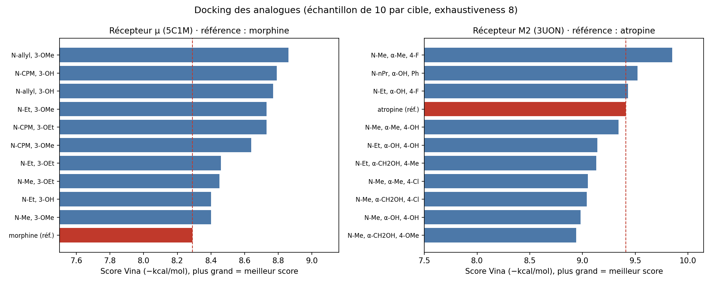
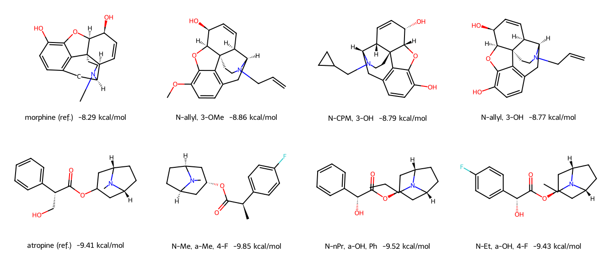

# Drug design : morphine et atropine

Pipeline reproductible de préparation de ligands, docking moléculaire et énumération d'analogues, appliqué à deux alcaloïdes dont les cibles sont bien caractérisées : la morphine (récepteur opioïde µ) et l'atropine (récepteur muscarinique M2).

| Notebook | Contenu | Colab |
|---|---|---|
| `01_ligand_prep` | SMILES PubChem, stéréochimie, conformères 3D | [](https://colab.research.google.com/github/AymaneAmri-MD/drug-design-morphine-atropine/blob/main/notebooks/01_ligand_prep.ipynb) |
| `02_docking` | Re-docking de validation, puis morphine et atropine | [](https://colab.research.google.com/github/AymaneAmri-MD/drug-design-morphine-atropine/blob/main/notebooks/02_docking.ipynb) |
| `03_generative` | Analogues (bibliothèques virtuelles) et filtrage par docking | [](https://colab.research.google.com/github/AymaneAmri-MD/drug-design-morphine-atropine/blob/main/notebooks/03_generative.ipynb) |

| Ligand | Cible | PDB |
|---|---|---|
| Morphine | Récepteur opioïde µ (chaîne A) | 5C1M |
| Atropine (L-hyoscyamine) | Récepteur muscarinique M2 (chaîne A) | 3UON |

## Objectifs

1. Préparer les ligands (SMILES, stéréochimie, conformères 3D) avec RDKit.
2. Valider le protocole par **re-docking** du ligand co-cristallisé (RMSD < 2 Å).
3. Docker morphine et atropine avec AutoDock Vina.
4. Énumérer des analogues, les filtrer, puis les docker et les comparer à la molécule de référence.

## Structure

```
data/        SMILES et structures d'entrée (pas de gros fichiers)
notebooks/   01_ligand_prep, 02_docking, 03_generative
src/         fonctions réutilisables
figures/     figures des résultats
results/     sorties (ignorées par git sauf exemples légers)
```

## Utilisation

Les notebooks sont conçus pour **Google Colab** (boutons ci-dessus, ou Fichier, puis Importer un notebook). Pour une installation locale :

```bash
conda env create -f environment.yml
conda activate drug-design
jupyter lab
```

## Avancement

- [x] 01 Préparation des ligands (RDKit)
- [x] 02 Docking (re-docking puis docking)
- [x] 03 Analogues et filtrage par docking
- [ ] 03b Modèle génératif (VAE sur SMILES), à venir

## Résultats

### 1. Validation du protocole (re-docking)

Le ligand co-cristallisé de chaque structure est retiré, puis redocké avec Vina dans sa propre poche.

| Cible | PDB | Ligand co-cristallisé | Score pose 1 (kcal/mol) | RMSD pose 1 (Å) | RMSD min, 10 poses (Å) | Validé (< 2 Å) |
|---|---|---|---|---|---|---|
| Récepteur µ | 5C1M | VF1 (BU72, agoniste) | −12,18 | 0,57 | 0,57 | oui |
| Récepteur M2 | 3UON | QNB (antagoniste) | −11,47 | 0,63 | 0,63 | oui |

Dans les deux cas, la pose de plus basse énergie est aussi la plus proche de la structure expérimentale : le protocole est validé pour ces deux cibles.

### 2. Docking des molécules de référence

| Molécule | Cible | Score (kcal/mol) |
|---|---|---|
| Morphine | µ (5C1M) | −8,29 |
| Atropine (L-hyoscyamine) | M2 (3UON) | −9,40 (exhaustiveness 16), −9,41 (exhaustiveness 8) |

Les scores sont stables d'un réglage de Vina à l'autre. Ils ne se comparent pas entre cibles, ni à ceux des ligands co-cristallisés, beaucoup plus grands.

### 3. Analogues

Deux bibliothèques virtuelles ont été énumérées à partir de substituants classiques en relation structure-activité :
- **Morphine** : substituant de l'azote (méthyle, éthyle, allyle, cyclopropylméthyle) × oxygène en position 3 (OH, OMe, OEt), soit 11 analogues, dont 10 tirés au hasard ont été dockés.
- **Atropine** : substituant de l'azote × substituant du carbone alpha × cycle aromatique, soit 71 analogues, dont un échantillon aléatoire de 10 a été docké.





| Cible | Analogue | Score (kcal/mol) | Écart à la référence |
|---|---|---|---|
| µ | N-allyle, 3-OMe | −8,86 | −0,57 |
| µ | N-cyclopropylméthyle, 3-OH | −8,79 | −0,50 |
| µ | N-allyle, 3-OH | −8,77 | −0,48 |
| M2 | N-méthyle, α-méthyle, 4-F | −9,85 | −0,44 |
| M2 | N-propyle, α-OH, phényle | −9,52 | −0,11 |
| M2 | N-éthyle, α-OH, 4-F | −9,43 | −0,02 |

### Lecture des résultats

- **Récepteur µ** : les 10 analogues obtiennent un meilleur score que la morphine (de −8,40 à −8,86 contre −8,29). Les meilleurs portent un substituant allyle ou cyclopropylméthyle sur l'azote. Que **tous** les analogues passent devant la référence suggère surtout un biais de taille de Vina (plus d'atomes en contact, meilleur score), dans une poche définie par un ligand co-cristallisé plus volumineux que la morphine.
- **Récepteur M2** : 3 analogues sur 10 dépassent l'atropine, le meilleur (α-méthyle, 4-fluoro) de 0,44 kcal/mol. Les autres sont à moins de 0,5 kcal/mol de la référence.
- **Dans les deux cas, les écarts (≤ 0,6 kcal/mol) sont bien inférieurs à l'erreur typique de Vina (de l'ordre de 2 kcal/mol).** Ils servent à formuler des hypothèses, pas à classer des affinités.

## Limites

- Les scores Vina sont des estimations grossières de l'énergie de liaison ; ils ne se comparent pas entre cibles ni à des affinités mesurées.
- **Vina ne distingue pas agoniste et antagoniste** : un analogue N-allyle ou N-cyclopropylméthyle de la morphine peut bien scorer sans avoir l'effet attendu, l'efficacité dépendant de la conformation induite du récepteur, que le docking rigide ne capture pas.
- Récepteurs rigides, préparés automatiquement (hydrogènes ajoutés à pH 7,4 par Open Babel), ligands dockés sous forme neutre alors que leurs amines sont surtout protonées à pH physiologique.
- 5C1M est un récepteur µ lié à un agoniste (état actif) et 3UON un récepteur M2 lié à un antagoniste (état inactif, fusion avec le lysozyme T4).
- L'atropine est représentée par son énantiomère actif (L-hyoscyamine). Les analogues conservent la stéréochimie de la référence, sans énumération des stéréoisomères.
- Les analogues sont énumérés par règles (pas de modèle génératif profond) et ne sont évalués ni pour leur synthétisabilité ni pour leur toxicité. Un échantillon de 10 analogues par cible ne couvre pas toute la bibliothèque.
- Seed fixé à 42 ; les résultats peuvent varier légèrement selon les versions de Vina et de Meeko.

*Note de parcours : le paclitaxel (cible : tubuline) avait été envisagé, puis écarté car trop flexible pour un calcul raisonnable sur Colab gratuit.*

## Licence

MIT
